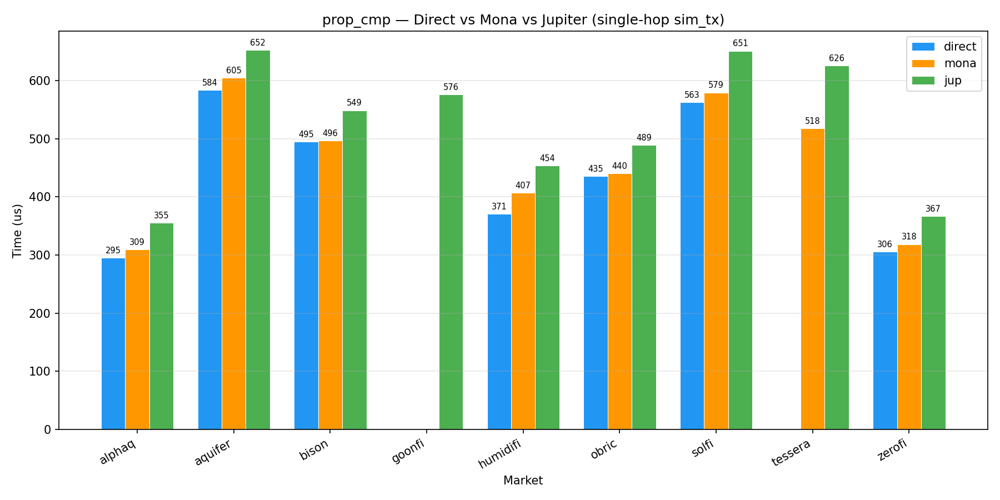

# Mona

CU-optimised onchain Solana router.

```
                                            o8%8888,
                                          o88%8888888.
                                         8'-    -:8888b
                                        8'         8888
                                       d8.-=. ,==-.:888b
                                       >8 `~` :`~' d8888
                                       88         ,88888
                                       88b. `-~  ':88888
                                       888b ~==~ .:88888
                                       88888o--:':::8888
                                       `88888| :::' 8888b
                                       8888^^'       8888b
                                      d888           ,%888b.
                                     d88%            %%%8--'-.
                                    /88:.__ ,       _%-' ---  -
                                        '''::===..-'   =  --.
```

The router supports two routing modes:

- chained: output of hop N feeds as amount_in to hop N+1, single slippage check at end.
- split: each hop reads its own amount_in, per-step slippage check on output delta.

---

CU benchmarks between Mona, Jupiter and direct (non-router) program hit:
| market | direct | mona | jup |
|-------:|-------:|-----:|----:|
| alphaq | 30,047 | 32,413 | 36,894 |
| aquifer | 74,069 | 79,924 | 80,183 |
| bison | 69,748 | 71,968 | 76,656 |
| goonfi | — | — | 87,703 |
| humidifi | 41,194 | 47,342 | 52,723 |
| obric | 54,406 | 56,813 | 61,111 |
| solfi | 82,616 | 90,086 | 99,717 |
| tessera | — | 63,198 | 79,376 |
| zerofi | 34,734 | 37,238 | 41,910 |

_swaps done at slot: 413,144,803_

Simulation time comparison (wall-clock, single-hop `sim_tx`):



---

The routing relies on a flat account layout, each adapter owns its full account slice. Instruction data (after selector):

```
   flags=0x01 (chained)                       flags=0x02 (split)
   ─────────────────────────────────          ─────────────────────────────────
   ┌──────────────────────┐                   ┌──────────────────────┐
   │ flags           (1B) │                   │ flags           (1B) │
   │ amount_in       (8B) │                   │ num_steps       (1B) │
   │ amount_out_min  (8B) │                   ├──────────────────────┤
   │ num_steps       (1B) │                   │ step[0].dex     (1B) │
   ├──────────────────────┤                   │ step[0].a_to_b  (1B) │
   │ step[0].dex     (1B) │                   │ step[0].amt_in  (8B) │
   │ step[0].a_to_b  (1B) │                   │ step[0].out_min (8B) │
   │ ...                  │                   │ ...                  │
   └──────────────────────┘                   └──────────────────────┘
   header: 18B, step: 2B each                 header: 2B, step: 18B each

   accounts:
   ┌──────────────────────────────────────────────┐
   │ [0]  payer (signer, writable)                │
   │ [1..N₀]  hop 0 remaining accounts            │ ← dex knows its own slice width
   │ [N₀..N₁] hop 1 remaining accounts            │   (mints, user TAs, vaults, etc.
   │ ...                                          │    all packed per-adapter)
   └──────────────────────────────────────────────┘

```

---

LICENSE: MIT
